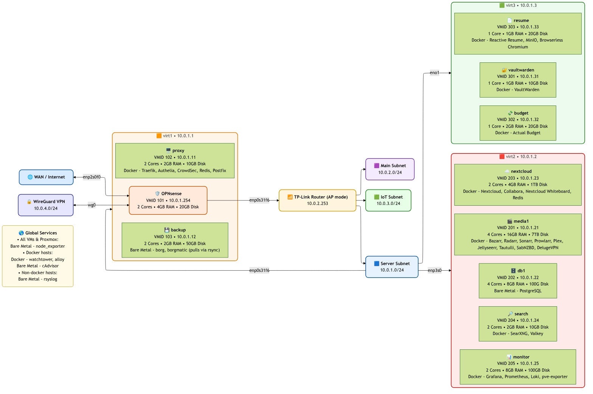

# Homelab — Infrastructure as Code with Ansible

A complete, reproducible **homelab** managed via **Ansible**, from hypervisors and VM lifecycle to system hardening, services, observability, and backups. This repo codifies the entire stack so it can be rebuilt and brought to a known-good state with a single playbook run.

---

## Highlights

- **End-to-end automation**: Hypervisor prep, VM provisioning from a Debian cloud-init template, per-host configuration, and service rollout.
- **Modular roles**: Concise roles for platform, data, access, apps, monitoring, and backups.
- **Secure by default**: Key-based SSH, password logins disabled, sensitive values kept out of the repo.
- **Observability first**: Metrics, logs, and exporters deployed automatically across the environment.
- **Safe to re-apply**: Idempotent playbooks (with the exception of `deploy-homelab.yml`); re-runs converge systems to the desired state.

---

## Architecture Diagram

<p align="center">
  
</p>

---

## Repository Layout (top level)

```
ansible.cfg                # Defaults: inventory, vault file, collections path, SSH tuning
hosts                      # Inventory: hypervisors + VM groups (services are applied by group)
deploy-homelab.yml         # Full bootstrap: hypervisors → VMs → services → hardening
homelab-services.yml       # Reconfigure services, restart stacks, re-apply hardening
update-services.yml        # As above + OS/package updates
docs/                      # Supporting documentation
roles/                     # Modular roles (platform, apps, monitoring, backups, etc.)
templates/                 # Shared Jinja templates (e.g., rsyslog)
vars/                      # Non-secret config
```

> **Secrets:** `vars/secrets.yml` and a private SSH key used for backups are intentionally **not** committed.

---

## What Gets Automated

### 1) Hypervisors & VM Lifecycle
- Configure hypervisors and form a **cluster** when multiple nodes exist.
- Fetch and import a **Debian cloud-init image**, convert to a **template**, and clone **VMs** from it.
- Reconfigure VM hardware (CPU model, disk sizing, special device access/acceleration for specific workloads).
- Start VMs and wait for **SSH** to be reachable.

### 2) Base System & Platform
- Install core packages, enable the **guest agent**, and ensure system services are running.
- Install and configure the **container runtime** and compose tooling.
- Deploy a lightweight **observability agent** and a **container metrics exporter** on hosts that run containers.

### 3) Network Edge & Access Control
- Deploy a **reverse proxy** with dynamic/static config.
- Configure an **identity-aware access gateway** (MFA/SSO, user directory, policies).
- Integrate a **security/bouncer** component; obtain and inject API credentials during provisioning.

### 4) Data & Core Services
- Install and configure a **relational database** server.
- Create databases/users from variables; enable an associated **exporter** for metrics.
- Roll out a set of **application stacks** via per-host compose files and templated configs (kept general by design).

### 5) Observability & Logging
- Centralize **metrics and logs**: deploy collectors, a time-series DB, log store, and UI.
- Install host-level **exporters** on hypervisors (including device/SMART telemetry).
- Configure **rsyslog** on non-container hosts to forward to the monitoring node.

### 6) Backups
- Install snapshot-based, deduplicating **backup tooling** and generate the backup configuration.
- Create/enable a **systemd service + timer** to schedule backups.
- Distribute a **public key** to VMs and register it with the offsite storage endpoint.

### 7) Hardening
- Enforce **key-only SSH** and disallow password authentication (including root).
- Ensure file ownerships/permissions and service unit overrides align with least privilege.

---

## Playbooks

- **`deploy-homelab.yml`**  
  Full bootstrap: hypervisors → cluster (if >1) → image import → VM creation/config → exporters → service roles → rsyslog → backup key distribution → compose up → SSH hardening.

- **`homelab-services.yml`**  
  Operational re-apply: warm SSH connections (for hardware tokens), gracefully stop running containers, re-apply roles for all service groups, rsyslog config, backup key checks, and bring stacks up.

- **`update-services.yml`**  
  Operational update: same as above **plus** OS/package updates.

> Use `--limit <host|group>` to scope runs.

---

## Roles (overview)

- **`vm`** — Base OS agents and essentials (e.g., guest agent).
- **`docker`** — Container runtime install, group membership, compose project for the observability agent, container metrics exporter.
- **`proxy`** — Reverse proxy and identity/security components, DB initialization for security state, dynamic credentials injection.
- **`db`** — Relational database server packages/config, DB/user provisioning from vars, metrics exporter.
- **`monitor`** — Metrics/logs stack: directories, configs (templated), and compose.
- **`backup`** — Backup tool install via isolated runtime, config render, systemd unit/timer, capability scoping for backup paths.
- **`media`** — General content-management/automation stack with optional hardware acceleration; network module prerequisites.
- **`nextcloud`** — General document cloud/collab suite: storage dirs, server config (templated), cache service, compose.
- **`search`** — Private search/metasearch stack: settings and compose.
- **`vaultwarden`** — Personal secrets vault stack with compose.
- **`budget`** — Personal finance stack: self-signed TLS for local use and compose.

---

## Configuration

- **Inventory (`hosts`)**: Hypervisors are listed with static addresses; VM hostnames are grouped by function.  
  Service plays target groups/hosts such as: `media_servers`, `proxy`, `db_servers`, `backup`, `nextcloud`, `budget`, `resume`, `search`, `monitor`, and a `docker` group.

- **Variables (`vars/config_vars.yml`)**: Non-secret runtime settings (owner identity, allowlists, endpoints, etc.).  
  **Secrets** live in a **redacted** file (`vars/secrets.yml`)

- **Templates**: Jinja2 templates render service configs (including syslog, app configs, and compose files) with host/group vars.

---

## Requirements

- **Ansible** and Python on your control node.
- **Collections** used by playbooks/roles:  
  `community.proxmox`, `community.docker`, `community.postgresql`, `community.crypto`, `prometheus.prometheus`.

Install with:
```bash
ansible-galaxy collection install -r requirements.yml
```

VMs are **Debian-based** (cloud-init image template).

---

## Typical Workflows

**Bootstrap a new environment**
```bash
ansible-playbook deploy-homelab.yml
```

**Reconfigure services (no OS updates)**
```bash
ansible-playbook homelab-services.yml
```

Scope to a subset:
```bash
ansible-playbook homelab-services.yml --limit monitor
```

**Update OS packages + services**
```bash
ansible-playbook update-services.yml
```

---

## Security & Secrets

- Password SSH logins are disabled; use **keys** (hardware-backed keys work well here).
- Keep secrets out of VCS. Store `vars/secrets.yml` with **Ansible Vault** (or your secret manager) and load at runtime.
- Backup credentials/keys are distributed programmatically

---

## Observability & Logging

- Hypervisors: host metrics + device/SMART telemetry.
- Container hosts: container metrics exporter and a local agent that ships logs/metrics.
- A central node runs the metrics/logs stack; non-container hosts forward syslog there.

---

## Backups

- Backups run on a schedule via `systemd` timer and target an offsite repository.
- Config is templated (sources, pruning, retention, health checks).
- Public keys are installed on VMs and registered with the remote endpoint.

---

## Further Documentation

- [Backups](docs/backups.md) — Usage of the borg + borgmatic backup server.
- [Bootstrap](docs/bootstrap.md) — End-to-end provisioning of new hosts from hypervisor to hardened services.
- [Observability](docs/observability.md) — Overview of metrics and logs collection across the homelab.
- [Operations](docs/operations.md) — Common day to day management tasks and commands.
- [Roles](docs/roles.md) — Overview of all Ansible roles and their purposes.
- [Security](docs/security.md) — SSH hardening, secrets management, and service access controls.

---

## Key Takeaways

- **IaC discipline** across virtualization, OS, apps, access, observability, and backups.
- **Modular Ansible** roles enable focused changes and easy expansion.
- **Operational maturity**: clear separation between bootstrap, service re-apply, and update flows.
- **Defense-in-depth**: identity-aware edge, explicit allowlists, least-privilege service units, and passwordless SSH.

